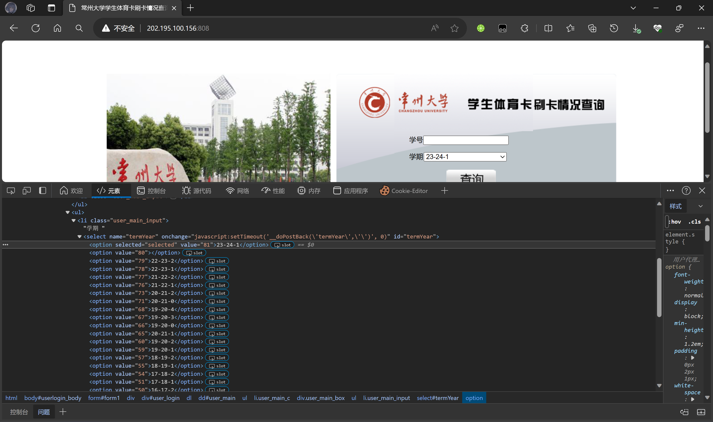

<div align=center>
  
  <h1 align="center">吊大助手</h1>
</div>

<div align=center>

  更加那么不蚌埠地查询体育打卡信息😋

  
  
  
</div>


## 为什么有这个

*OSA有一个用于查询打卡和讲座前端项目CCZU Helper，这也算是延续了🤔*

为什么吊大的体育打卡查询做的这么烂，为什么全是ASP.NET😡😡😡

## 截图


## 使用方法

先去设置里设置学期和学号，然后在主页点击刷新等待几分钟(?)即可🥰

## 关于学期

体育打卡网站 http://202.195.100.156:808/

按下 F12 打开 Dev Tool 选择元素移到学期框上就能定位找到

`value`的值是你需要的，例如我想查`23-24-1`，它的`value`就是81，而你需要在设置里填写81



## Using Rust Inside Flutter

This project leverages Flutter for GUI and Rust for the backend logic,
utilizing the capabilities of the
[Rinf](https://pub.dev/packages/rinf) framework.

To run and build this app, you need to have
[Flutter SDK](https://docs.flutter.dev/get-started/install)
and [Rust toolchain](https://www.rust-lang.org/tools/install)
installed on your system.
You can check that your system is ready with the commands below.
Note that all the Flutter subcomponents should be installed.

```bash
rustc --version
flutter doctor
```

You also need to have the CLI tool for Rinf ready.

```bash
cargo install rinf
```

Messages sent between Dart and Rust are implemented using Protobuf.
If you have newly cloned the project repository
or made changes to the `.proto` files in the `./messages` directory,
run the following command:

```bash
rinf message
```

Now you can run and build this app just like any other Flutter projects.

```bash
flutter run
```

For detailed instructions on writing Rust and Flutter together,
please refer to Rinf's [documentation](https://rinf.cunarist.com).

