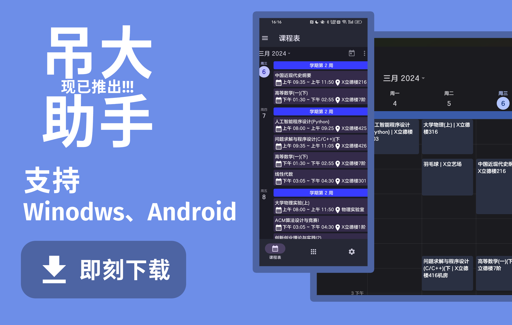

<div align=center>
  
  <h1 align="center">吊大助手</h1>
</div>

<div align=center>

一款改善你在CCZU的生活体验的应用😋


  
  
  
</div>

## 为什么有这个

起源于吊大的打卡查询的应用，起初是自用的应用，后来觉得不如做好点发出来大家一起用，技术本身就是用来改善生活的，希望这个应用能让你在吊大更加便利~

[](https://github.com/CCZU-OSSA/cczu-helper/releases/latest)

## 平台支持

| Windows | Android | Linux | MacOS | IOS |
| ------- | ------- | ----- | ----- | --- |
| ✅       | ✅       | ✅     | ✅     | ❌   |


## 参与本项目

### 反馈意见

如果不知道如何在Github提issue，可以搜一下`如何提issue`

https://github.com/CCZU-OSSA/cczu-helper/issues

### 项目结构

- lib 存放Flutter代码
    - models 存放数据类型与一些常量还有一些用于沟通Rust和Flutter的代码
    - views 存放页面文件
    - controllers 存放配置文件的读取、页面更换等相关代码
    - messages 由rinf生成
 - messages 存放用于生成沟通Rust与Flutter的proto文件
 - assets 存放应用资源文件
 - native 存放Rust代码(Powered by `CCZUNI`)

### 如何编译

编译之前先确保你的设备上拥有 Rust 与 Flutter 环境，需要`clone`此项目你还需要一个`git`

然后运行以下代码

`<target-platform>`取决于你的目标平台

可以使用`flutter help build`命令查看

```sh
git clone https://github.com/CCZU-OSSA/cczu-helper.git
cd cczu-helper
cargo install rinf
rinf message
flutter build <target-platform> --release
```
